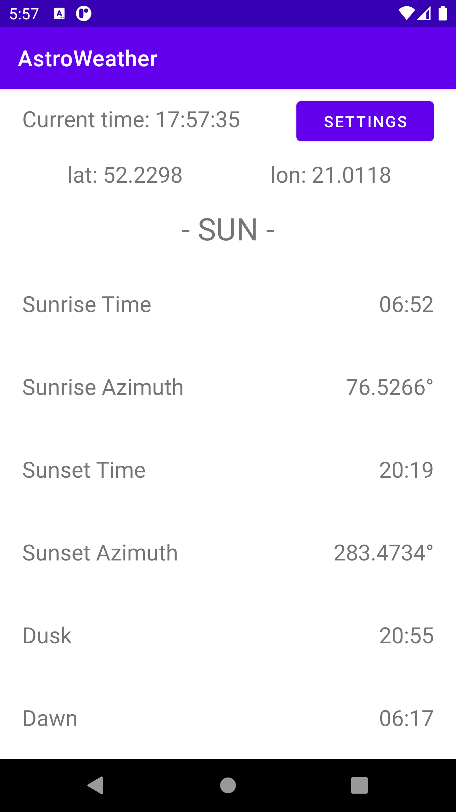
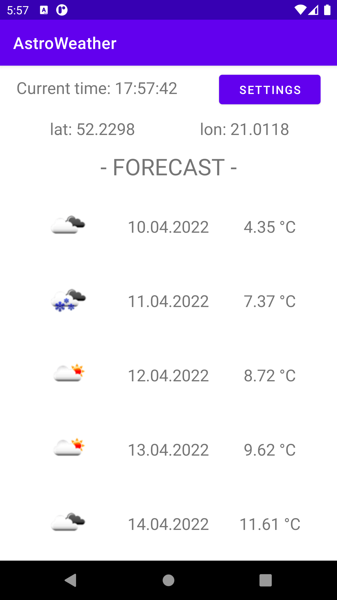
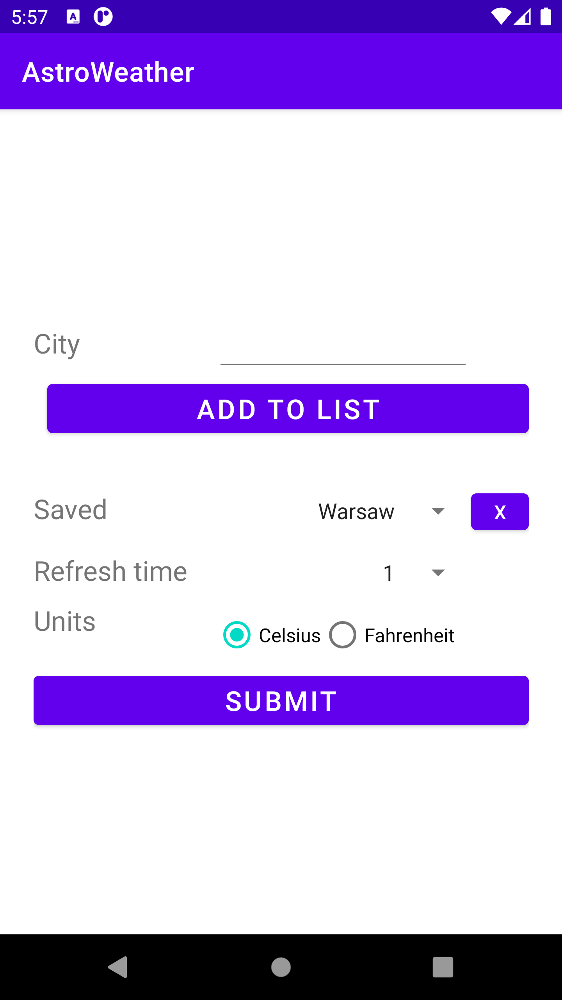

# AstroWeather
 Aplikacja mobilna pozwalająca na sprawdzanie pogody oraz danych astronomicznych dla wprowadzonych lokalizacji. Dane pobierane są z zewnętrznego API OpenWeatherMap.

# Screenshots

    </img>
    </img>
    </img>

